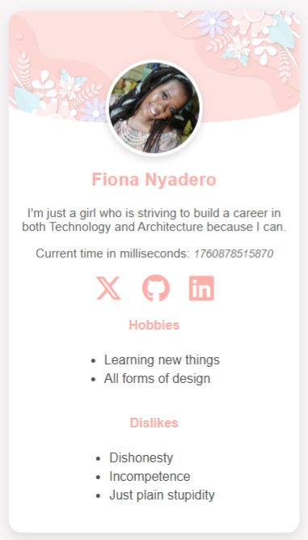

# 🌸 HNG Profile Card — Fiona Nyadero

A beautiful, responsive **profile card** built as part of the **HNG Internship (Stage 0)** task.  
This project showcases my HTML, CSS, and JavaScript skills while introducing who I am —  
a passionate learner merging the worlds of **Technology and Architecture**.

---

## 🚀 Live Demo

🔗 [https://fiona-nyadero.github.io/hng13-frontend/](#)

---

## 🧩 Project Overview

The **Profile Card** is a simple yet elegant webpage displaying:

- 👩🏽 **Name & Bio**
- 🖼️ **Profile Image**
- ⏱️ **Dynamic Time in Milliseconds**
- 🌐 **Social Media Icons** (Twitter/X, GitHub, LinkedIn)
- 🎨 **Stylized Hobbies & Disli**

📁 hng_frontend_phase0
│
├── index.html # Main HTML file
├── style.css # Styling and layout
├── script.js # Dynamic time logic
└── assets/
└── profile.jpg # User avatar image

---

## 🧾 Features

✅ Responsive design — adapts to all screen sizes  
✅ Accessible icons with `aria-labels`  
✅ Transparent overlay image over curved gradient header  
✅ Smooth hover effects for social links  
✅ Clean and readable typography

---

## 🖼️ Preview



---

## ⚙️ Installation & Setup

1. **Clone this repository**
   ```bash
   git clone https://github.com/Fiona-Nyadero/hng13_frontend.git
   ```

Open the project

cd hng-profile-card

Run locally

Simply open index.html in your browser.

💡 Future Improvements

Add dark/light mode toggle 🌗

Include an “About Me” expandable section

Use a live clock instead of static milliseconds

🧑🏽‍💻 Author

Fiona Nyadero
Merging the worlds of Technology and Architecture — because nobody told me I can’t.
🌐 LinkedIn
| 🐦 Twitter/X
| 💻 GitHub

🏁 Acknowledgements

This project was created for the HNG Internship (Stage 0 - Frontend).
Big thanks to the HNG team for pushing us to build, learn, and grow 🚀

⭐ If you like this project, don’t forget to star the repo!
